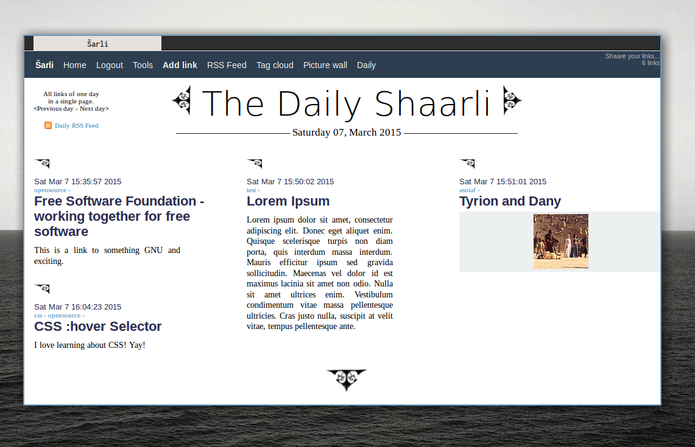
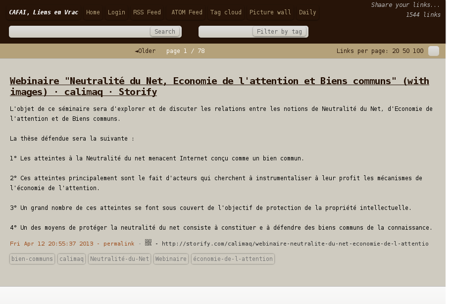
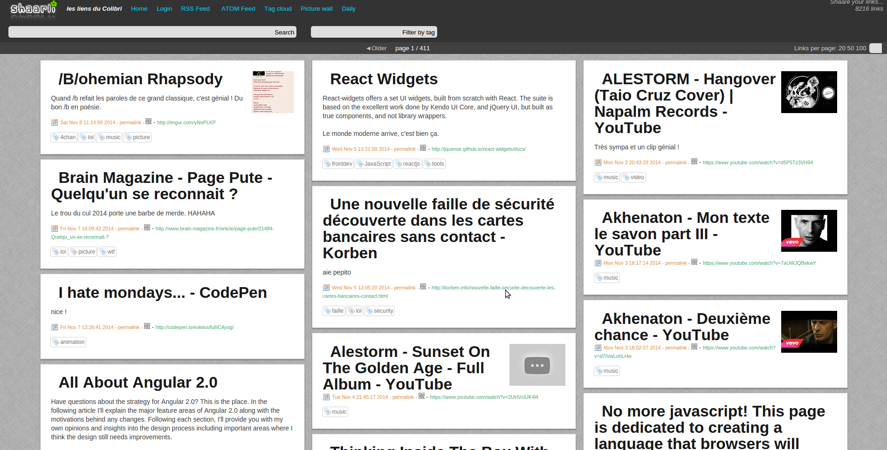
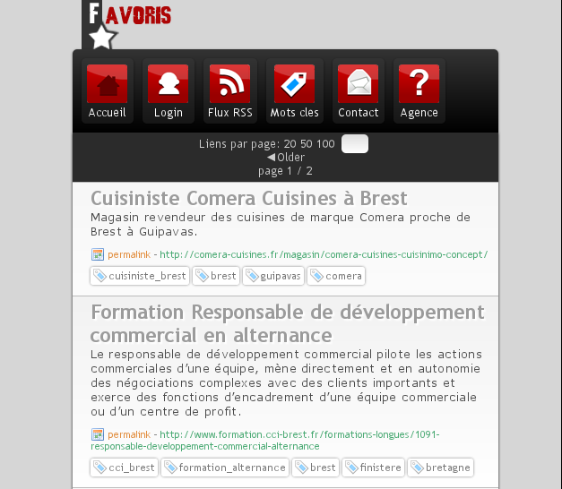
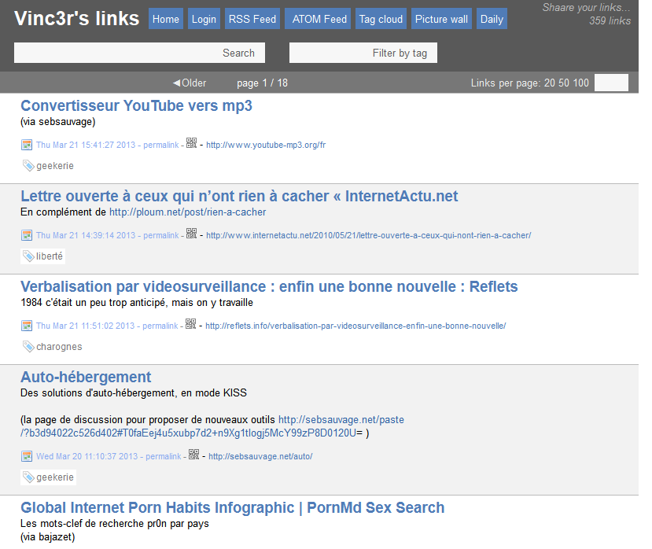

## Shaarli-themes
A collection of unofficial themes/stylesheets for [Shaarli](https://github.com/shaarli/Shaarli).  

This repository is a **currently UNMAINTAINED**. Themes may cause compatibility issues.  [Read the themes wiki](https://github.com/shaarli/shaarli-themes/wiki), and use at your own risk**. A full [rewrite of Shaarli's template and CSS](https://github.com/shaarli/Shaarli/issues/266) is being discussed.

More themes can be found at https://github.com/virtualtam/shaarli-themes-virtualtam

## Usage

Download the theme's CSS file and save it as `inc/user.css` in your Shaarli directory.

## Screenshots

#### Serious

Author: Miloš Jovanović  
Source https://github.com/mrjovanovic/serious-theme-shaarli  
License: Affero GPL v.3  

#### Cafai

Source http://shaarli.cafai.fr/  
License: zlib

#### Dhoko

Author: dhoko (https://github.com/dhoko)
License: zlib

#### Perrot

Author: Thierry Perrot
Source: http://perrot.thierry.free.fr/  
License: zlib

#### Vinc3r

Source: http://www.nothing-is-3d.com/links/  
License: zlib
