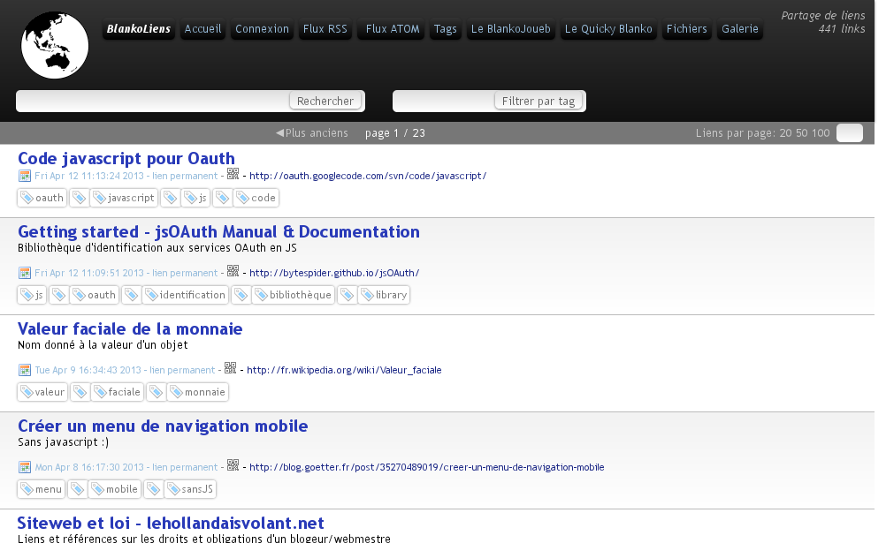
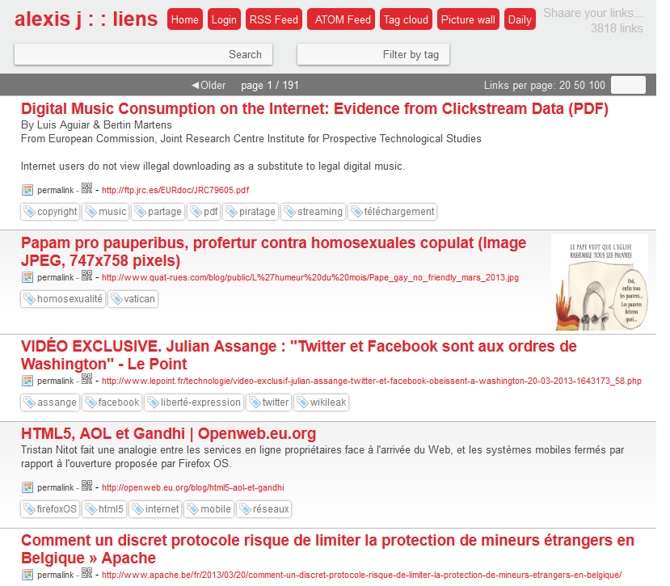
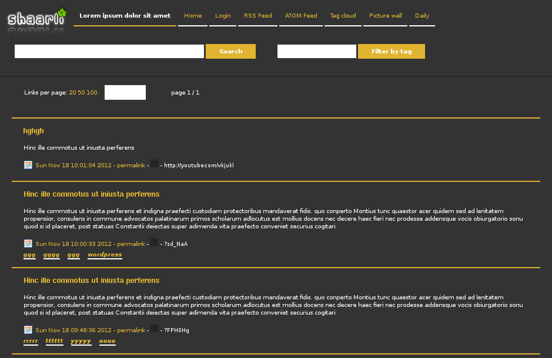
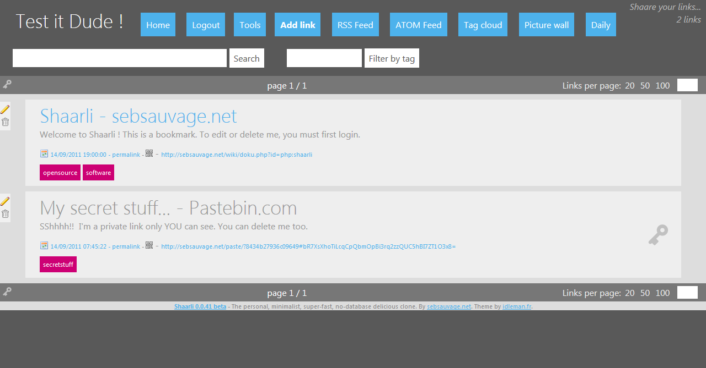
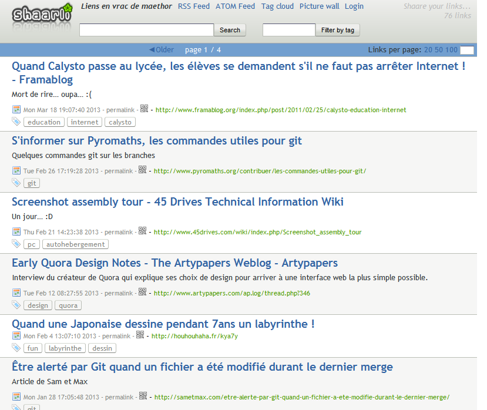
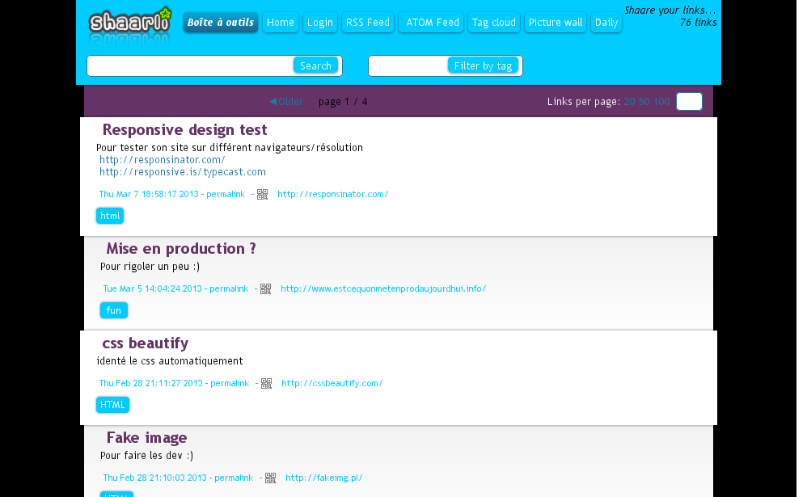
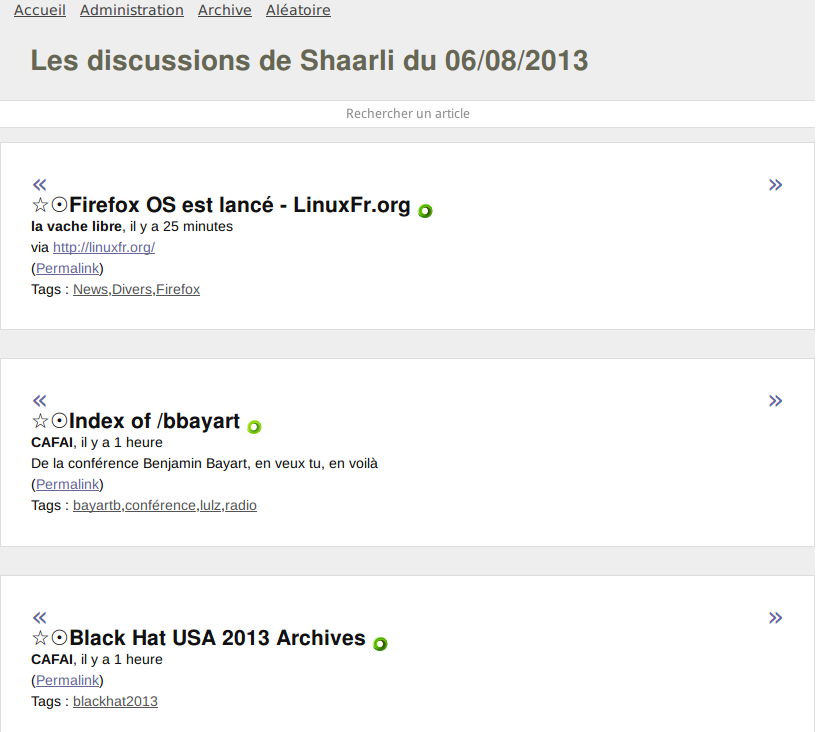

## Shaarli-themes
A collection of unofficial themes/stylesheets for [Shaarli](https://github.com/shaarli/Shaarli).  

This repository is a **work in progress**. Themes have not been reviewed and may cause compatibility issues, or break navigation on your Shaarli. [Read the themes wiki](https://github.com/shaarli/shaarli-themes/wiki), and use at your own risk**

## Usage

Download the theme's CSS file and save it as `inc/user.css` in your Shaarli directory.

## Screenshots

#### Cafai

#### Dhoko

#### Dossmann

#### Effingo

#### Emporeso

#### Flaaty

#### Maethor

#### Perrot

#### Richard9

#### Shaarlifr

#### Vinc3r
